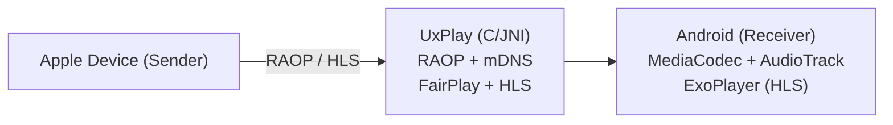

# AirPlay Receiver for Android

[](LICENSE)
[](https://github.com/manu-tech-code/airplay-receiver/actions/workflows/apk.yml)
[](https://github.com/manu-tech-code/airplay-receiver/releases)

A free and open-source implementation of AirPlay for Android that turns your device into an AirPlay-compatible display and speaker. It works with iOS/iPadOS and macOS devices as well as other sender implementations.

This is a fork of [jqssun/android-airplay-server](https://github.com/jqssun/android-airplay-server), which is itself built on the [UxPlay](https://github.com/FDH2/UxPlay) AirPlay/RAOP implementation.

Builds are published to [GitHub Releases](https://github.com/manu-tech-code/airplay-receiver/releases).

## Compatibility

- Android 7.0+, including Android TV
- AirPlay devices on the same subnet, including iOS/iPadOS, macOS devices, or other sender implementations

## Features

- Screen mirroring with H.264 and H.265 (HEVC) video decoding
- Audio streaming with AAC-ELD, AAC-LC and ALAC audio decoding
- Video playback with support for HLS, downloads, and remote controls
- Music playback with track information, cover art, and remote controls
- Support for Android TV with directional pad navigation and seeking controls
- Support for Picture-in-Picture, automatic resolution and mode switching
- Optional PIN authentication
- Video resolution, overscan, and frame rate control
- Audio latency control and support for software decoder fallback
- Debug overlay with real-time statistics (FPS, bitrate, codec, resolution, frame count, audio volume, etc.)
- Android native media session integration with notification controls

> [!WARNING]
> DRM content (e.g. from the Apple TV application) is not supported.

## Implementation

This application uses the C-based [UxPlay](https://github.com/FDH2/UxPlay) library to implement the AirPlay/RAOP protocol, with a JNI bridge to the Android application layer. Audio can be decoded via MediaCodec or a software ALAC decoder, while mirroring video is decoded via MediaCodec and rendered to a SurfaceView. HLS sessions are served through a local playlist proxy.



CMake is used for native C/C++ components under [`app/src/main/cpp`](app/src/main/cpp). All native dependencies (UxPlay, FFmpeg, libplist, OpenSSL) are vendored in-tree under [`app/src/main/cpp/third_party`](app/src/main/cpp/third_party), so there are no submodules to initialize and the build makes no network requests for source. See [PROVENANCE.md](app/src/main/cpp/third_party/PROVENANCE.md) for upstream revisions and local modifications.

```bash
./gradlew assembleDebug
```

### Releasing

Releases are automated. Bump `appVersionName` in [`app/build.gradle.kts`](app/build.gradle.kts) and push it to `main`:

```kotlin
val appVersionName = "1.0.1"
```

[`.github/workflows/apk.yml`](.github/workflows/apk.yml) then tags `v1.0.1`, builds the APK and AAB, verifies the signature with `apksigner`, and publishes a GitHub Release with `SHA256SUMS.txt` and generated notes. Pushing to `main` without changing the version does nothing, so only a deliberate bump cuts a release.

`versionCode` is derived from `appVersionName` as `major*10000 + minor*100 + patch`, so it always increases; Play rejects uploads whose `versionCode` did not. Keep minor and patch below 100.

Tagging by hand still works, as does the workflow's manual dispatch, but both require the tag to match `appVersionName`. The tag is created only after the artifacts build, so a failed build never leaves a tag pointing at an unreleased commit.

Every push to any branch also runs [`just_build.yml`](.github/workflows/just_build.yml), which uploads an APK and AAB as workflow artifacts without releasing.

Signing uses two repository secrets, `STORE` and `LOCAL`, created once via [`scripts/ci-keystore.sh`](scripts/ci-keystore.sh).

## Credits

- [android-airplay-server](https://github.com/jqssun/android-airplay-server) by jqssun, the project this is forked from
- [UxPlay](https://github.com/FDH2/UxPlay) for the AirPlay/RAOP server implementation
- [FFmpeg](https://ffmpeg.org) for the lossless audio decoder
- [Next Player](https://github.com/anilbeesetti/nextplayer) for the video player

---

Disclaimer: This project is not affiliated with Apple Inc.
